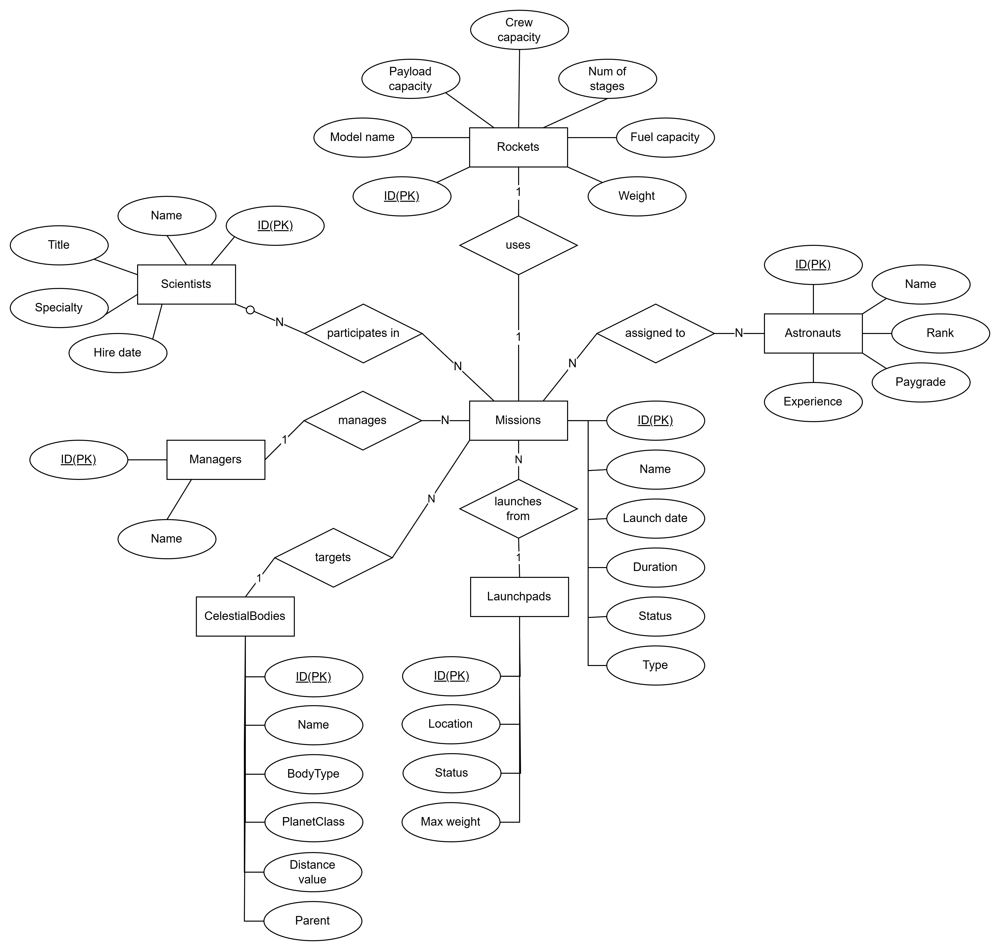

# AarhusSpaceProgram.MissionManagement.Api

## Project URL's
**API base URL**: http://localhost:5110  
**Scalar UI**: http://localhost:5110/scalar/  
**OpenAPI JSON**: http://localhost:5110/openapi/v1.json  

## E/R diagram

## Process description
Before starting the project, I planned how I could manage the project. This was important because I was to develop the project alone. I made a backlog to ensure I would meet all the requirements.  

I started by creating a new ASP.NET Core Web API project, and exposing the /scalar and OpenAPI endpoints. Then i created the datamodel using EF Core. I used a code first approach, and created the database using migrations.  

I then created the controllers and services to manage the missions, and implemented the required endpoints.  

To ensure I met all the requirements within the deadline, I prioritized implementation of endpoints and features. Then I could imporove exception handling, validation, and constraints afterwards.